[](https://github.com/Osura10/FindTone/actions/workflows/ai-service-ci.yml)
[](https://github.com/Osura10/FindTone/actions/workflows/backend-ci.yml)
[](https://github.com/Osura10/FindTone/actions/workflows/frontend-ci.yml)
[](https://github.com/Osura10/FindTone/actions/workflows/mobile-ci.yml)

# FindTone – MusicMarket

FindTone (shown to users as **MusicMarket**) is a marketplace for buying and selling musical instruments in
Sri Lanka. Four AI agents check every listing for a fair price and a trustworthy seller, match listings to
buyers' alerts, and help buyers shop through a chat assistant.

| Part | Tech | Port |
| --- | --- | --- |
| `backend/` | ASP.NET Core 8 Web API, EF Core, PostgreSQL (Supabase), Cloudinary | 5036 |
| `ai-service/` | Python FastAPI + LangChain (Ollama or Gemini), 4 agents | 8000 |
| `frontend-web/` | React 19 + Vite – buyers, shops **and admins** | 5173 |
| `frontend-mobile/music_market/` | Flutter (Material 3) – buyers and shops | – |

---

## Features by role

### Buyer (web + mobile)
- Browse and search the marketplace (title, brand, model, category) with filters for category, brand,
  condition and price. Sold items stay visible with a **SOLD OUT** ribbon and cannot be bought.
- Listing details with photo gallery, specs, map and the seller's phone (call / WhatsApp).
- **Wishlist** – get a `PRICE_DROP` notification when a saved listing gets cheaper.
- **My Alerts** – describe what you want in plain words ("used Yamaha guitar under 40k in Colombo"),
  **Fill with AI** turns it into filters; you get a `NEW_MATCH` notification for matching listings
  (also for listings that already exist when the alert is saved).
- **Shopping assistant** chat (Agent 04): find, compare and check prices; it can create an alert for you.
- Checkout with **card** (demo) or **cash on delivery**; **My Orders**.
- Notifications with an unread badge (polled every 30 s), mark one / all as read, tap to open the listing.
- Buyers can also sell – everything in the Shop list below.

### Shop (web + mobile)
- Register as a shop – an admin verifies the shop before the first login.
- **Create a post**: up to 6 photos, free-text category and brand with suggestions (values are cleaned,
  e.g. `travel   melodica` → `Travel Melodica`), map pin, **Check Price** (AI fair-price range + suggested price).
- On save the AI runs the **fair price** (Agent 01) and **trust & fraud** (Agent 02) checks:
  trust 70+ → LIVE, 40–69 → LIVE with a warning, below 40 / duplicate photos / over LKR 200,000 → held for
  admin review.
- **My Listings** with status, trust score and fair-price verdict (only the owner and admins see these).
- **Edit a post** – the form is pre-filled and **only the changed fields are sent**; quick price change.
- **My Sales** with the buyer's delivery details, and an `ITEM_SOLD` notification for each sale.

### Admin (web only)
- Dashboard with user and moderation stats (charts with a table view).
- Approve / revoke shops and admins, add admins, delete users.
- Review queue for flagged and pending listings: approve, reject with a note, or re-check with the AI.
- View any listing (with the AI details) and **delete** it with a reason (the seller is notified);
  listings that already have an order cannot be deleted. Admins cannot buy.

Trust score, AI reason and fair-price verdict are **never** sent to the public or to other buyers – only to
the listing's owner and admins.

---

## Screenshots

| Web | |
| --- | --- |
| 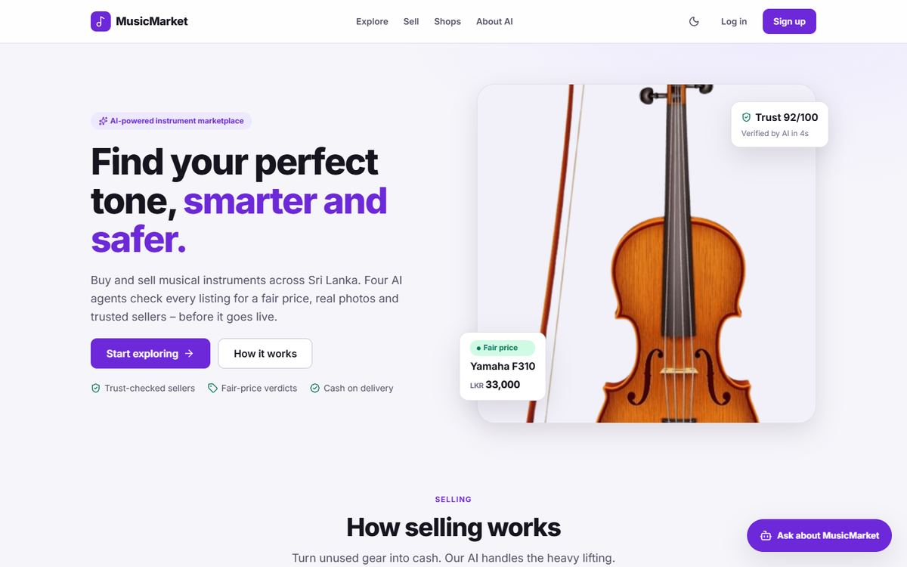 | 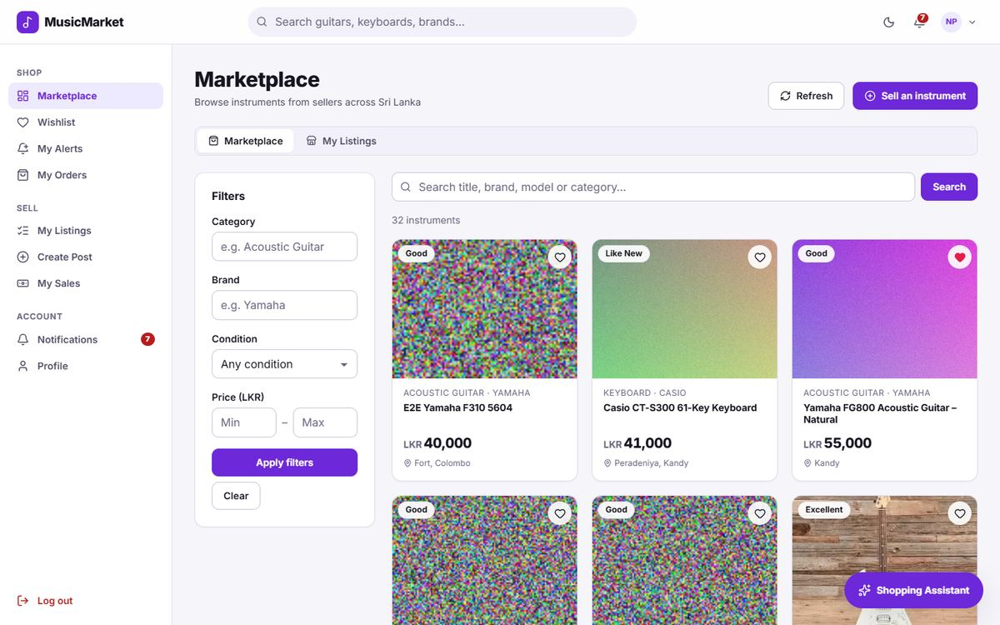 |
| 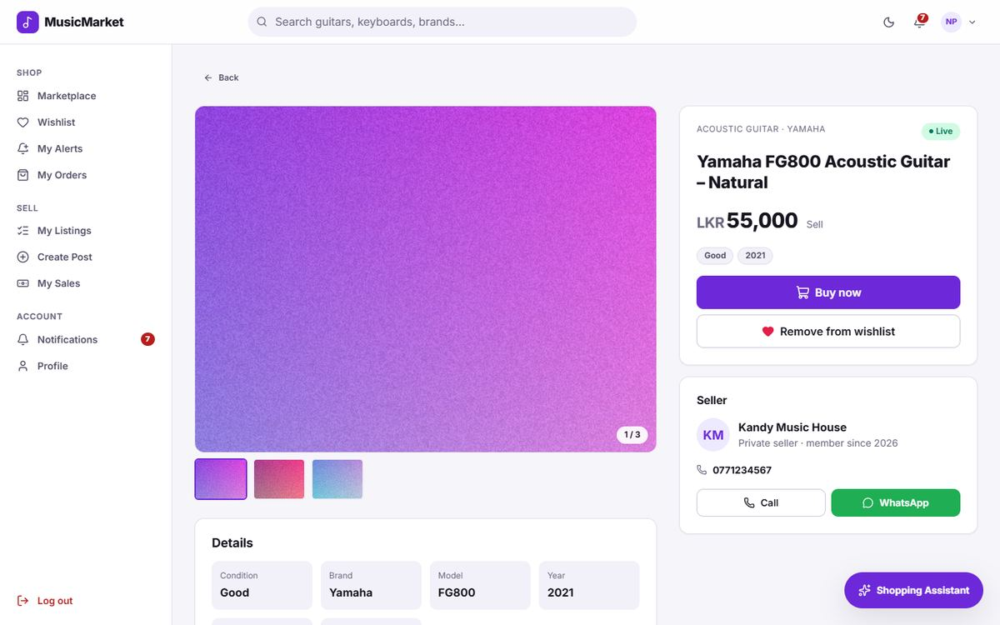 | 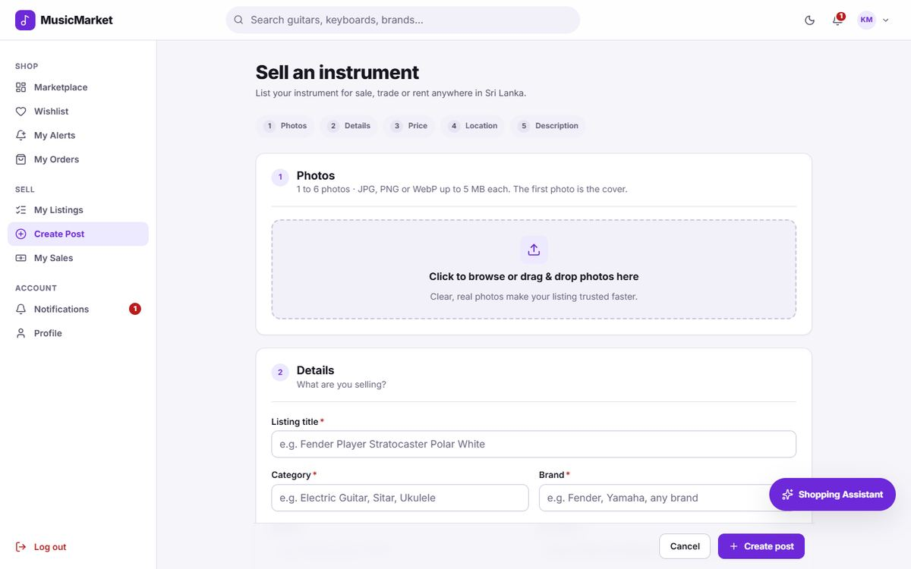 |
| 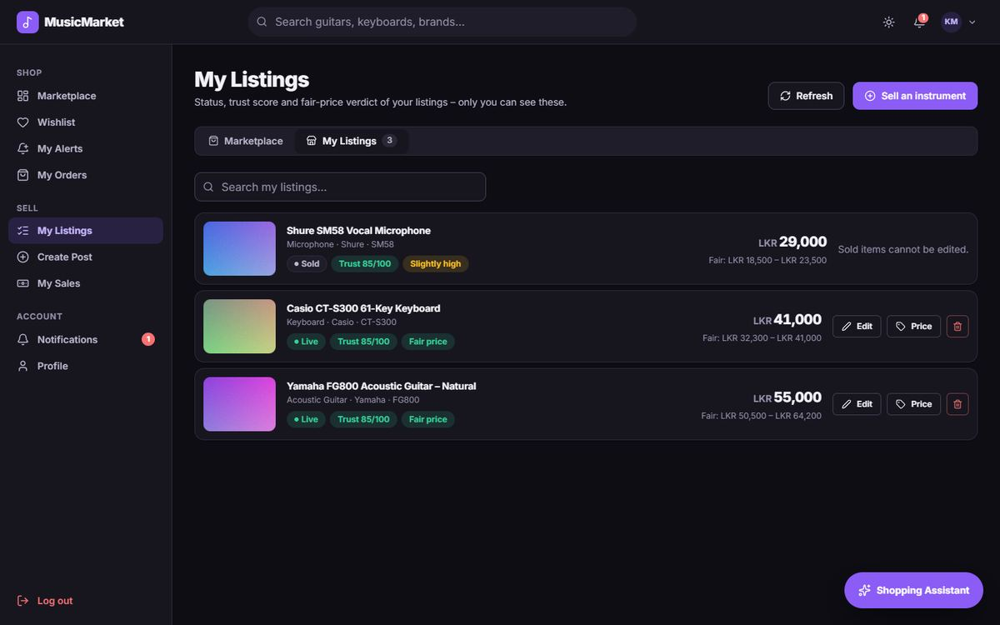 | 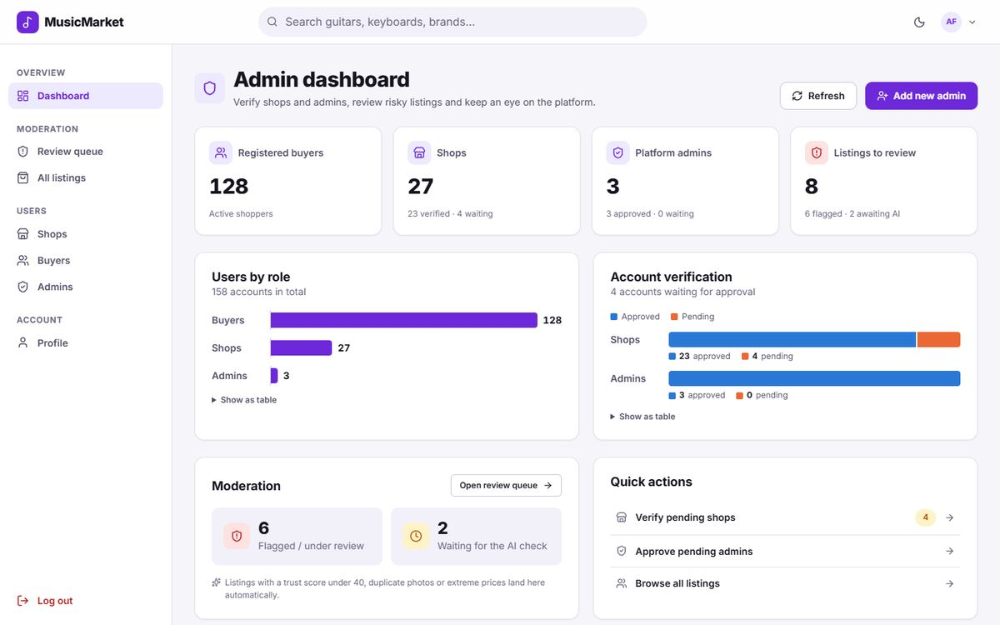 |

Admin review queue: [docs/screenshots/web-admin-review-queue.jpg](docs/screenshots/web-admin-review-queue.jpg)
(admin screenshots use sample data).

| Mobile | | | | |
| --- | --- | --- | --- | --- |
| 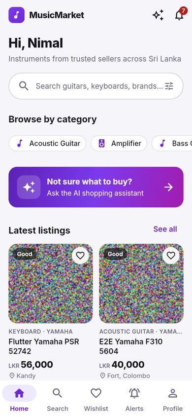 | 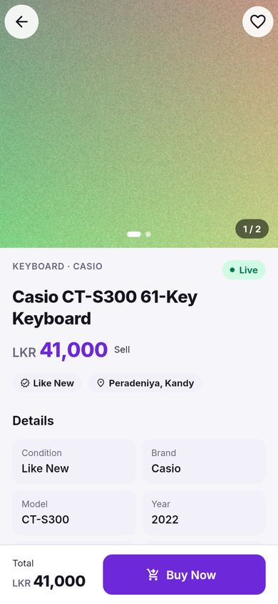 | 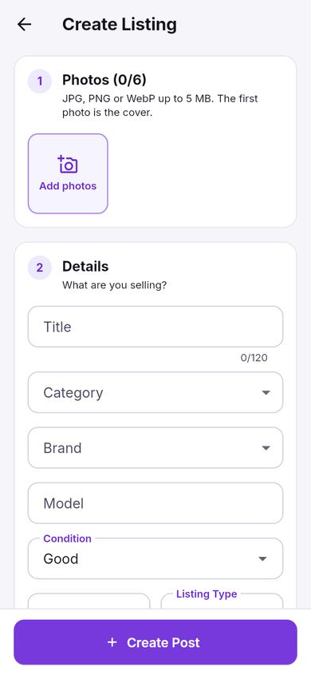 | 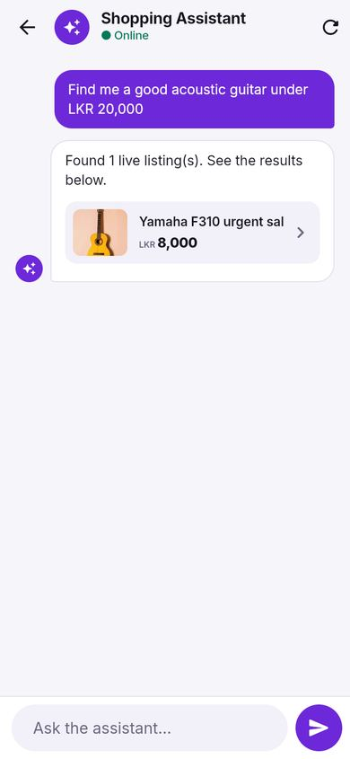 | 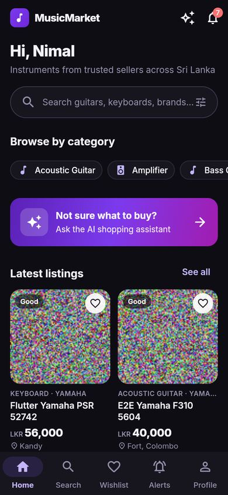 |

---

## How to run (Windows)

Prerequisites: .NET 8 SDK, Node.js 22+, Python 3.12+, Flutter (stable), and either Ollama running locally
or a Google Gemini API key.

### 1. Configuration (never commit these files)
- `backend/MusicMarket.Api/.env` – copy `backend/MusicMarket.Api/.env.example`:
  `DATABASE_URI`, `CLOUDINARY_URL`, `AI_SERVICE_URL`, `AI_INTERNAL_KEY` (optional).
  JWT settings are in `appsettings.json`.
- `ai-service/.env` – copy `ai-service/.env.example`: `LLM_PROVIDER` (`ollama` or `gemini`),
  `GOOGLE_API_KEY`, `DATABASE_URI`, `ENABLE_CLIP` (`false` for a fast start), `X_INTERNAL_KEY` (optional,
  must equal the backend's `AI_INTERNAL_KEY`).

### 2. Start the services (one terminal each)
```powershell
# Backend API – http://localhost:5036 (Swagger: /swagger). Applies database migrations on start.
cd backend\MusicMarket.Api; dotnet restore; dotnet run --launch-profile http

# AI service – http://localhost:8000
cd ai-service; python -m venv .venv; .venv\Scripts\activate; pip install -r requirements.txt
uvicorn api:app --host 127.0.0.1 --port 8000

# Web – http://localhost:5173
cd frontend-web; npm install; npm run dev

# Mobile – Android emulator (uses 10.0.2.2:5036) or Chrome
cd frontend-mobile\music_market; flutter pub get; flutter run        # or: flutter run -d chrome
```

### 3. Tests (the same commands as CI)
```powershell
cd backend\MusicMarket.Api; dotnet build; dotnet test ..\MusicMarket.Tests      # 38 tests, in-memory SQLite
cd ai-service; pytest tests -v                                                   # 44 tests
cd frontend-web; npm ci; npm run lint; npm run build
cd frontend-mobile\music_market; flutter analyze; flutter test; flutter build apk --debug   # 42 tests
```

---

## Test accounts and demo payment

Demo accounts on the shared development database (password `TestPass#2026` for both):

| Role | Email |
| --- | --- |
| Buyer | `claude.design.buyer.1790876049316@example.com` (Nimal Perera – has a wishlist item, an alert, an order and notifications) |
| Seller | `claude.design.seller.1790876049316@example.com` (Kandy Music House – has listings and a sale) |

Admin accounts are not listed here – ask a team member, or have an existing admin create one from the web
dashboard (**Add new admin**). New shops can log in after an admin approves them.

**Demo card** (card payments are simulated, only the last 4 digits are stored):
card number `1234 1234 1234 1234`, any future expiry (`MM/YY`), any 3-digit CVV. Any other card number is
rejected. Cash on delivery needs no card.

---

## AI agents

| Agent | Endpoint | What it does |
| --- | --- | --- |
| 01 Fair Price | `POST /api/agents/fair-price` | Fair price range, suggested price and verdict (great deal … overpriced) |
| 02 Trust & Fraud | `POST /api/agents/trust-check` | Trust score 0–100 from image, price and seller signals; routes to LIVE / warning / review |
| 03 Smart Alert | `POST /api/agents/smart-alert`, `/smart-alert/backfill`, `/parse-alert` | Matches listings to alerts; turns plain text into alert filters |
| 04 Shopping Assistant | `POST /api/agents/shopping-assistant` | Chat: search, compare, price insight, create alerts |

### Agent 02 - Trust & Fraud Check Agent

**Purpose:**  
To automatically evaluate the safety, authenticity, and pricing of musical instrument listings, identifying potential scams, duplicates, or severely miscategorized items before they mislead buyers.

**Where it runs in the app:**  
- Triggered immediately after a **Create Listing** or **Update Price** operation in the backend, right after the Fair Price agent has evaluated the listing.
- Available on-demand for manual re-runs via the **Admin Recheck** endpoint.

#### Tools

| Tool Name | What it does | Input | Output |
| --- | --- | --- | --- |
| `verify_images` | Downloads images, calculates their perceptual hashes to find duplicates, and uses zero-shot CLIP inference to verify the instrument matches the stated category. | `listing_id` (int) | Duplicate IDs found, category match state (e.g. "match" or "mismatch"), and a list of PHashes. |
| `check_price_signals` | Evaluates if the requested price is suspiciously low compared to the fair market range. | `listing_id` (int) | `price_mismatch` (boolean indicating if it's too low). |
| `get_seller_history` | Calculates seller reputation based on total sales and the frequency of previously rejected or flagged listings. | `listing_id` (int) | Total listings, rejected listings count. |
| `calculate_trust_and_route` | Applies standard logic rules against the gathered tool signals, calculates a final score, and determines the routing decision. | `category_mismatch` (bool), `duplicate_count` (int), `price_mismatch` (bool), `rejected_count` (int) | `trust_score` (int), `decision` (string), and itemized signal penalties. |

#### Penalty & Routing Rules

**Scoring:**  
- **Base Score:** 100
- **Image Category Mismatch:** -30 pts
- **Price Suspiciously Low:** -20 pts
- **Previously Rejected Listings:** -15 pts per listing
- **Duplicate Images Found:** -40 pts (forces immediate FLAGGED decision)

**Routing Decision:**  
- **LIVE (Score 70+):** The listing is approved and immediately visible to buyers.
- **LIVE with Warning (Score 40-69):** The listing is visible; the owner and admins see a "low trust" warning.
- **FLAGGED (Score < 40, Duplicate Image Found, or Price > LKR 200,000):** The listing is hidden from buyers and placed in a queue for manual Admin review.

#### Image Verification & Category Check

**Duplicate Detection (PHash):**  
Using the `imagehash` library, each image is downloaded and converted to a perceptual hash (PHash) string. These hashes are compared against the database using a Hamming distance threshold to confidently identify visually similar or identical photos already used by other listings.

**Zero-Shot Category Verification (CLIP):**  
The `transformers` CLIP model is used to compare each image against a textual prompt (e.g., "a photo of a {category}"). If the visual features strongly diverge from the listed category text, the model returns a low similarity score, signaling a potential scam or upload mistake.

#### ENABLE_CLIP

Since the CLIP model is resource-intensive and large, it is only loaded into memory if `ENABLE_CLIP=true` is set in the environment variables. If `ENABLE_CLIP=false`, the agent skips category checking and defaults to a "match" for all images.

#### Data Flow & Fallback Strategy

**Why numbers come from tools:**  
LLMs can be unpredictable when calculating exact penalty points. Therefore, the Agent calls `calculate_trust_and_route`, and the final numeric score and structured signals are extracted *directly* from the tool's output dictionary rather than relying on the LLM's raw text generation. The LLM only writes a human-readable "reason".

**Fallback:**  
If the AI encounters a Python exception, rate limit, or timeout, a deterministic fallback kicks in. It assigns a base score of 50, marks it as "PENDING" (meaning it defaults to manual review), and records that the fallback was triggered.

#### Admin Review Flow

Flagged and pending listings appear in the admin **Review queue**. From there, admins can:
1. **Approve:** Force the listing to "LIVE".
2. **Reject:** Mark the listing as "REJECTED" and append a note detailing the reason.
3. **Re-check:** Send the listing back through the AI pipeline to re-evaluate it against updated rules or market data.

#### Running Tests

```bash
cd ai-service
pytest tests/test_trust_tools.py -v
```

#### Example Request/Response

**Request:** `POST /api/agents/trust-check`
```json
{
  "listing_id": 142
}
```

**Response:**
```json
{
  "listing_id": 142,
  "trust_score": 50,
  "decision": "FLAGGED",
  "warning": false,
  "signals": [
    {
      "code": "IMG_CATEGORY_MISMATCH",
      "points": -30,
      "detail": "Images do not appear to match the category 'Electric Guitar'."
    },
    {
      "code": "PRICE_SUSPICIOUSLY_LOW",
      "points": -20,
      "detail": "Price is suspiciously lower than the fair market minimum."
    }
  ],
  "reason": "This listing has been flagged because the provided photos do not resemble an Electric Guitar. Additionally, the asking price is suspiciously low compared to typical market values.",
  "image_hashes": [
    {
      "image_id": 412,
      "phash": "a8c2f1b4d6e9c8f0"
    }
  ],
  "duplicate_listing_ids": [],
  "used_fallback": false
}
```
